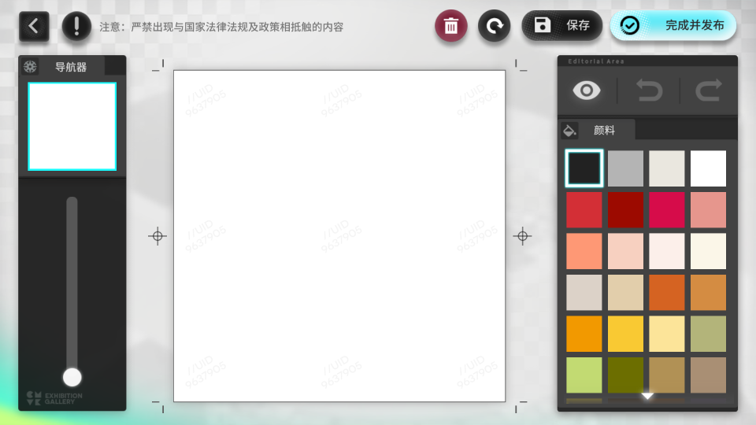

# bad-paint-arknights

`bad-paint-arknights` is a Python script that drives an Android emulator with ADB, reads frames from a source video, and recreates them in Arknights' Interactive Exhibition painting scene frame by frame. It captures screenshots after each frame and can compile the result into `output.mp4`.

## Requirements

- Python 3 with the packages in `requirements.txt`
- `adb` and `ffmpeg` (optional) available on your PATH or configured in `config.json`
- ABI-matched minitouch binaries (see below)

### ffmpeg

ffmpeg is optional. The script uses it to compile the captured screenshots into a video, combining the original audio from the source video. If ffmpeg is not available, the script will use OpenCV as a fallback, but then the resulting video will not have audio, and you'll need to manually add the audio track later in some video editing software.

### minitouch

minitouch itself does not provide prebuilt binaries. You can either build them yourself or download them from somewhere. A recommended source is [MaaAssistantArknights](https://github.com/MaaAssistantArknights/MaaAssistantArknights/tree/dev-v2/resource/minitouch). After downloading, place them under `assets/minitouch/`, and the file structure should look like this:

```
assets/
└── minitouch/
    ├── arm64-v8a/
    │   └── minitouch
    ├── armeabi-v7a/
    │   └── minitouch
    ├── x86/
    │   └── minitouch
    └── x86_64/
        └── minitouch
```

### Quick access if you have MaaAssistantArknights (MAA) installed

If you already have MAA installed, you can set up adb and minitouch easily.

1. Go to MAA's Settings > Connection Settings > ADB Path, copy the path and paste it into `config.json`. For example:

   ```jsonc
   "adb_path": "C:\\Program Files\\Netease\\MuMuPlayer-12.0\\shell\\.\\adb.exe",
   ```

2. Set the `minitouch_binaries_dir` to point to MAA's `minitouch` directory. For example:

   ```jsonc
   "minitouch_binaries_dir": "D:/MAA/resource/minitouch",
   ```

## Setup

1. Create a virtual environment and install dependencies:

   ```bash
   python -m venv .venv
   .venv\Scripts\activate
   pip install -r requirements.txt
   ```

2. Copy `config.example.json` to `config.json` and adjust options if needed.
3. It's recommended to set your emulator to a resolution of 1920x1080 and a higher FPS (>= 30) for best results. Other resolutions are not tested and not guaranteed to work.

## Usage

Make sure your Android emulator or device is running with Arknights open and navigated to the Interactive Exhibition painting scene:



Put your source video in `assets/`. The script will automatically detect the first video file in that directory.

Then, run the script from the project root:

```bash
python main.py
```

The script will:

1. Connect to the emulator through ADB.
2. Detect the canvas, palette, and clear button.
3. Clear the canvas.
4. Sample the source video and draw each frame.
5. Save screenshots to `screenshots/` and debug images to `debug/`.
6. Build `output.mp4` from the captured screenshots.

## Config

```jsonc
{
  // Paths
  "assets_dir": "assets",
  "templates_dir": "assets/templates",
  "screenshots_dir": "screenshots",
  "debug_dir": "debug",
  "output_video_path": "output.mp4",
  "adb_path": "adb",
  "ffmpeg_path": "ffmpeg",

  // The emulator serial to connect to. If null, the first available device will be used.
  "emulator_serial": null,

  // Minitouch configuration
  "minitouch_binaries_dir": "assets/minitouch",
  "minitouch_host_port": 1111,
  "minitouch_tap_hold_sec": 0.02,
  "minitouch_swipe_step_px": 12,
  "minitouch_swipe_step_delay_sec": 0.01,

  // How many frames per second to sample from the source video. The output video will also be at this frame rate.
  "draw_fps": 5,

  // Frame range to draw. If frame_end is null, the entire video will be drawn.
  "frame_start": 0,
  "frame_end": null,

  // How to scale the source video frames to fit the canvas. Options are "normal" (fit to canvas) and "cover" (fill canvas, cropping as needed).
  "source_scale_mode": "normal",

  // Threshold for template matching.
  "template_score_threshold": 0.55,

  // Delay after each touch action to allow the emulator and app to react and render.
  "action_delay_sec": 0.08,

  // Timeout when waiting for the clear confirmation dialog to appear. If exceeded, the script will retry a few times before failing.
  "clear_confirm_timeout_sec": 3.0,

  // Maximum duration for capturing a single frame from the emulator. If exceeded, the script will fail.
  "frame_wait_timeout_sec": 5.0,

  // Logging level.
  "log_level": "INFO",
}
```

## Color Mapping

The script simply calculates the luma of each pixel in the source frame and maps it to a color from the palette.

Currently, the only usable colors are black, light gray and white. Theoretically, the script can be extended to support all colors in the palette, but that would involve more complex logic as the palette is a scrollable panel and would require the script to handle scrolling when selecting colors.
